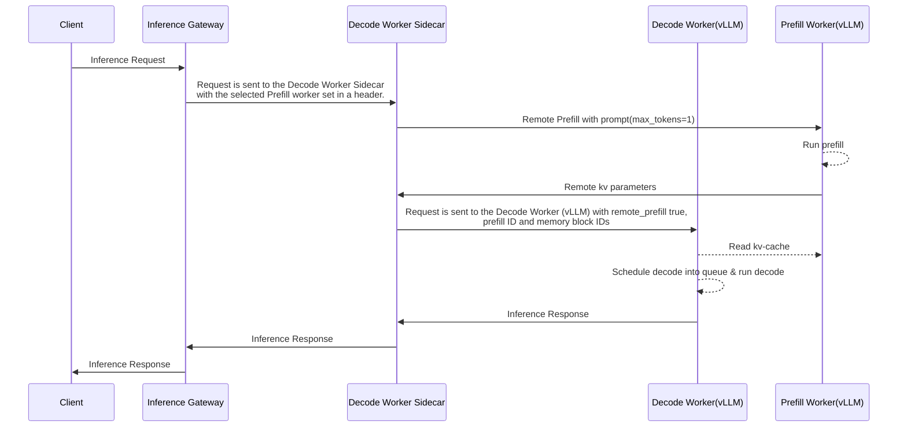

# Disaggregated Prefill/Decode Inference Serving in LLM-D

## Overview

This document describes the architecture and request lifecycle for enabling **disaggregated prefill and decode (P/D)** inference execution in the LLM-D router. The architecture aims to improve flexibility, scalability, and performance by enabling separation of prefill and decode stages onto different workers.

This evolved version removes the requirement for sidecars on the **prefill node**, simplifying deployment while maintaining orchestration from the **decode node**.

---

## Goals

- Enable routing of prefill and decode to different pods
- Maintain low latency and high throughput
- Improve resource utilization by specializing pods for prefill or decode
- Align with GIE-compatible architectures for potential upstreaming

---

## Key Components

| Component            | Role                                                                 |
|----------------------|----------------------------------------------------------------------|
| **Prefill Worker**   | Handles only prefill stage using vLLM engine                         |
| **Decode Worker**    | Handles decode stage and contains the sidecar for coordination       |
| **Sidecar (Decode)** | Orchestrates communication with prefill worker and manages lifecycle |
| **Envoy Proxy**      | Accepts OpenAI-style requests and forwards them to EPP               |
| **EPP**              | Endpoint Picker, makes scheduling decisions                     |

---

## Request Lifecycle

1. **User Request**
   - Sent via OpenAI API to the Envoy Proxy

2. **EPP Scheduling Decision**
   - EPP evaluates:
     - Prompt length
     - KV-cache hit probability
     - System and pod load
   - Selects either:
     - **Single node** path (decode handles all)
     - **Split node** path (distinct prefill and decode workers)
   - Returns Decode Worker (always), and optionally Prefill Worker URL

3. **Execution**
   - Request lands on Decode Worker (as selected by EPP)
   - Decode sidecar coordinates:
     - If `x-prefiller-host-port` header doesn't exist, runs both stages locally by passing request to local vLLM
     - If `x-prefiller-host-port` header exists:
       - Sends the prefill job to the selected Prefill Worker with a special request field `do_remote_decode=true`
       - Upon receiving the response from the Prefill Worker runs the decode stage

4. **Response Flow**
   - Response flows from decode sidecar → Envoy → EPP → User

---

## Architectural Details




### Sidecar Responsibilities (Decode Only)

- Receives EPP metadata (decode pod, optional prefill pod)
- Sends request to prefill
- Waits for the result and validates it
- Launches local decode job
- Sends final response

> **Note**: No sidecar or coordination logic is needed on the prefill node.

---

## Worker Selection Logic

- **Decode/Prefill Worker**:
  - Prefer longest prefix match/kv-cache utilization (depends on available scorers) and low load

> **Skip prefill worker** when:
> - Prefix match/kv-cache hit is high
> - Prompt is very short

---


## Drawbacks & Limitations

- Slight increase in TTFT for disaggregated P/D 
- Possibility of stranded memory on prefill crash
- The need for timeout and retry logic

---

## Design Benefits

- **Flexibility**: Enables per-request specialization and resource balancing
- **Scalability**: Clean separation of concerns for easier ops and tuning
- **Upstream-ready**: Follows GIE-compatible request handling
- **Minimal Changes**: Only decode node includes orchestration sidecar

---

## Future Considerations

- Cache coordinate
- Pre-allocation of kv blocks in the decode node, push cache from the prefill to the decode worker during calculation

---

## Integrating External Prefill/Decode Workloads

The LLM-D inference scheduler supports integration with external disaggregated prefill/decode (P/D) workloads other inference frameworks that follow the same P/D separation pattern but use **different Kubernetes Pod labeling conventions**.

### Labeling Convention Flexibility

By default, LLM-D uses the label key `llm-d.ai/role` with values:
- `"prefill"` → prefill-only pods
- `"decode"` or `"both"` → decode-capable pods  

However, external systems may use alternative labels like:
```yaml
role: prefill
role: decode
```

To accommodate this **without code changes**, you can configure the **EndpointPickerConfig** to use the generic `by-label` filter plugin instead of the hardcoded `prefill-filter` / `decode-filter`.

### Configuration Example

Below is a minimal `EndpointPickerConfig` that enables integration with workloads using label `role=prefill` / `role=decode`:

```yaml
apiVersion: inference.networking.x-k8s.io/v1alpha1
kind: EndpointPickerConfig
featureGates:
- prepareDataPlugins
plugins:
  # Prefill selection: match Pods with label role=prefill
  - type: by-label
    name: "prefill-pods"
    parameters:
      label: "role"
      validValues: ["prefill"]
  # Decode selection: match Pods with label role=decode
  - type: by-label
    name: "decode-pods"
    parameters:
      label: "role"
      validValues: ["decode"]
  - type: prefix-cache-scorer
    parameters:
      autoTune: false
      blockSize: 5
      maxPrefixBlocksToMatch: 256
      lruCapacityPerServer: 31250
  - type: max-score-picker
  - type: prefill-header-handler
  - type: prefix-based-pd-decider
    parameters:
      nonCachedTokens: 8
  - type: pd-profile-handler
    parameters:    
      deciderPluginName: prefix-based-pd-decider
      primaryPort: 8000
schedulingProfiles:
  - name: prefill
    plugins:
      - pluginRef: "prefill-pods"
      - pluginRef: "max-score-picker"
      - pluginRef: "prefix-cache-scorer"
  - name: decode
    plugins:
      - pluginRef: "decode-pods"
      - pluginRef: "max-score-picker"
      - pluginRef: "prefix-cache-scorer"
```

---

## Diagram


--- 
## PD Deciders

PD deciders are pd handler plugins responsible for determining whether disaggregated P/D should be executed for a given request, based on the properties of the request prompt.

 
### Prefix-Based PD Decider

The `prefix-based-pd-decider` plugin makes the disaggregation decision according to the length of the non-cached suffix of the prompt relative to tokens already cached on the selected decode pod.

**How It Works**
- Once a decode pod is selected, the decider checks how many tokens from the incoming prompt have already been sent to this pod

- If the remaining non-cached suffix length is longer than the configured threshold (nonCachedTokens), disaggregation is triggered — the prefill will run remotely on a prefill pod, and decode locally on the decode pod

- If the non-cached suffix is shorter or equal to the threshold, the full request runs locally on the decode worker without remote prefill

**Configuration**
```yaml
- type: prefix-based-pd-decider
  parameters:
    nonCachedTokens: 8
```

**Parameter:**

- `nonCachedTokens`: Number of non-cached tokens that trigger disaggregation
  - If set to 0, disaggregation always occurs for all requests

**Feature Gate Requirement**
To activate this decider, ensure the following feature gate is enabled in your EndpointPickerConfig

```yaml
featureGates:
- prepareDataPlugins
```


### Always-Disagg PD Decider
The `always-disagg-pd-decider` is a simpler alternative used mainly for testing or benchmarking.
It always triggers disaggregation, regardless of prefix cache state or prompt characteristics.

**Configuration example:**

```yaml
- type: always-disagg-pd-decider
```

**Notes:**
This plugin accepts no parameters.

It’s useful for validating end-to-end prefill/decode splitting and comparing system performance under forced disaggregation.

---

## References
